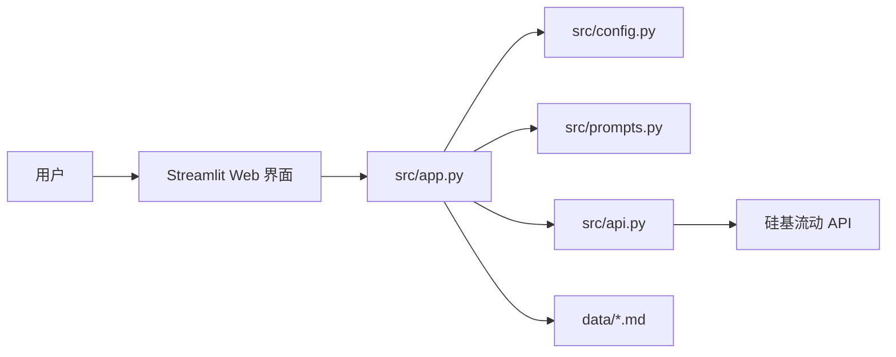

# 小航 · 校园信息查询 AI 助手 - 系统设计文档

## 1. 系统架构

### 1.1 整体架构



### 1.2 模块职责

| 模块 | 职责描述 |
|------|---------|
| `src/app.py` | Streamlit 主程序，负责界面渲染、用户交互、会话管理 |
| `src/config.py` | 配置管理，读取环境变量（API_KEY、API_URL、MODEL_NAME 等） |
| `src/prompts.py` | Prompt 工程，包含身份分流策略、别名词典、防幻觉硬规则、推荐问题 |
| `src/api.py` | API 调用模块，封装硅基流动 API 请求、异常处理、响应解析 |
| `data/*.md` | 校园数据文件，AI 回答的知识来源 |

## 2. 目录结构

```
xiaohang_helper/
├── src/                    # 源代码
│   ├── __init__.py         # 模块初始化与导出
│   ├── app.py              # Streamlit 主程序
│   ├── prompts.py          # Prompt 工程（身份分流 + 数据注入）
│   ├── api.py              # 硅基流动 API 调用
│   └── config.py           # 配置项（API_URL、MODEL_NAME 等）
├── data/                   # 校园数据文件（Markdown）
│   ├── 01_新生入学.md
│   ├── 02_办事流程.md
│   ├── 03_电话黄页.md
│   ├── 04_应急防骗.md
│   └── 05_交通出行.md
├── docs/                   # 文档
│   ├── 需求分析文档.md
│   └── 系统设计文档.md
├── tests/                  # 测试（选填）
├── screenshots/            # 项目截图
├── .gitignore              # Git 忽略配置
├── .env.example            # 环境变量示例
├── requirements.txt        # 依赖清单
└── README.md               # 项目说明
```

## 3. 关键类与函数设计

### 3.1 config.py

| 变量名 | 类型 | 作用 | 默认值 |
|--------|------|------|--------|
| `API_URL` | str | 硅基流动 API 地址 | `https://api.siliconflow.cn/v1/chat/completions` |
| `API_KEY` | str | API 密钥 | 从环境变量读取 |
| `FAST_MODEL` | str | 使用的模型名称 | `Qwen/Qwen2.5-7B-Instruct` |
| `DATA_DIR` | str | 数据文件目录 | `../data` |
| `MAX_TOKENS` | int | 最大生成 token 数 | 3000 |
| `TIMEOUT` | int | 请求超时时间（秒） | 60 |
| `TEMPERATURE` | float | 温度参数 | 0.3 |

### 3.2 prompts.py

| 变量/函数 | 类型 | 作用 |
|-----------|------|------|
| `ALIAS_DICT` | str | 别名词典，映射校园常用别称 |
| `HARD_RULES` | str | 防幻觉硬规则，约束 AI 回答行为 |
| `ROLE_PROMPTS` | dict | 身份分流 Prompt，不同身份不同语气 |
| `RECOMMENDED_QUESTIONS` | dict | 推荐问题，每类身份 4 个 |
| `get_system_prompt()` | func | 组装完整的 System Prompt |

### 3.3 api.py

| 函数 | 参数 | 返回值 | 作用 |
|------|------|--------|------|
| `ask_ai()` | `messages: list` | `(answer: str, elapsed_time: float, error: str)` | 调用硅基流动 API，返回回答、耗时、错误信息 |

### 3.4 app.py

| 函数 | 作用 |
|------|------|
| `clean_markdown_text()` | 清洗 Markdown 文本，处理引号和乱码 |
| `load_school_data()` | 加载所有 Markdown 数据文件 |
| `load_phone_directory()` | 加载电话黄页数据 |
| `parse_phone_directory()` | 解析电话黄页 Markdown 为结构化数据 |
| `clean_answer()` | 清洗 AI 回答，移除首尾引号和乱码 |
| `check_hard_rules()` | 检查硬规则，处理特殊问题（心理危机、个人信息查询等） |
| `ask_xiaohang()` | 完整问答流程：规则检查 → Prompt 组装 → API 调用 → 回答清洗 |
| `main()` | Streamlit 主函数，界面渲染与交互逻辑 |

## 4. 数据库与数据结构设计

### 4.1 数据文件格式（Markdown）

每个数据文件遵循以下格式：

```markdown
> 维护人：小航项目组
> 更新日期：2026-07-16
> 数据来源：郑州航院官网 / 学生手册

## 主题一
### 子主题
- **字段**：内容 ⚠ 以官方为准
- **字段**：内容 ✏️ 待核实

## 主题二
...
```

### 4.2 会话状态数据结构

```python
# 当前身份
st.session_state.identity = "新生"

# 当前对话历史（用于上下文）
st.session_state.chat_history = [
    {"question": "报到那天先去哪?", "answer": "..."},
    {"question": "学费什么时候交?", "answer": "..."}
]

# 问答历史记录（用于导出）
st.session_state.history = [
    {
        "time": "10:30:00",
        "identity": "新生",
        "question": "...",
        "answer": "...",
        "time_cost": 2.5,
        "word_count": 120
    }
]
```

## 5. API 接口设计

### 5.1 外部 API（硅基流动）

**请求方式**：POST

**请求地址**：`https://api.siliconflow.cn/v1/chat/completions`

**请求头**：
```json
{
    "Content-Type": "application/json",
    "Authorization": "Bearer <API_KEY>"
}
```

**请求体**：
```json
{
    "model": "Qwen/Qwen2.5-7B-Instruct",
    "messages": [
        {"role": "system", "content": "<System Prompt>"},
        {"role": "user", "content": "<用户问题>"}
    ],
    "temperature": 0.3,
    "max_tokens": 3000,
    "top_p": 0.9,
    "frequency_penalty": 0.1,
    "presence_penalty": 0.1
}
```

**响应格式**：
```json
{
    "choices": [
        {
            "message": {
                "content": "<AI 回答内容>"
            }
        }
    ]
}
```

## 6. 主业务流程与调用链

### 6.1 问答流程

```mermaid
flowchart TD
    A[用户输入问题] --> B{空问题检查}
    B -->|空| C[提示"请输入问题"]
    B -->|非空| D{长度检查}
    D -->|>500字| E[提示"问题太长"]
    D -->|<500字| F{硬规则检查}
    F -->|命中规则| G[返回规则响应]
    F -->|未命中| H[组装 System Prompt]
    H --> I[构建消息列表]
    I --> J[调用 ask_ai]
    J --> K{请求成功?}
    K -->|否| L[返回错误信息]
    K -->|是| M[清洗回答]
    M --> N[保存对话历史]
    N --> O[显示回答]
```

### 6.2 调用链

| 步骤 | 调用方 | 被调用方 | 文件位置 |
|------|--------|----------|----------|
| 1 | 用户交互 | `main()` | `src/app.py` |
| 2 | `main()` | `ask_xiaohang()` | `src/app.py` |
| 3 | `ask_xiaohang()` | `check_hard_rules()` | `src/app.py` |
| 4 | `ask_xiaohang()` | `get_system_prompt()` | `src/prompts.py` |
| 5 | `ask_xiaohang()` | `ask_ai()` | `src/api.py` |
| 6 | `ask_xiaohang()` | `clean_answer()` | `src/app.py` |
| 7 | `main()` | `load_school_data()` | `src/app.py` |
| 8 | `load_school_data()` | `clean_markdown_text()` | `src/app.py` |

## 7. 部署与集成方案

### 7.1 环境要求

- Python 3.8+
- Streamlit 1.35.0+
- requests 2.31.0+
- python-dotenv

### 7.2 运行方式

```bash
# 安装依赖
pip install -r requirements.txt

# 设置环境变量（复制 .env.example 为 .env）
cp .env.example .env
# 编辑 .env，填入 API_KEY

# 启动应用
streamlit run src/app.py
```

### 7.3 配置项说明

| 配置项 | 说明 | 示例值 |
|--------|------|--------|
| `API_KEY` | 硅基流动 API 密钥 | `sk-xxxxxxxxxxxx` |
| `API_URL` | API 地址（可选） | `https://api.siliconflow.cn/v1/chat/completions` |
| `MODEL_NAME` | 模型名称（可选） | `Qwen/Qwen2.5-7B-Instruct` |

## 8. 代码安全性

### 8.1 注意事项

| 风险点 | 风险等级 | 关联模块 |
|--------|----------|----------|
| API Key 泄露 | 高 | `src/config.py`, `.env` |
| 用户输入注入 | 中 | `src/app.py` |
| 敏感信息泄露 | 中 | `src/app.py` |
| 数据文件读取 | 低 | `src/app.py` |

### 8.2 解决方案

1. **API Key 保护**：
   - 使用 `.env` 文件存储密钥，不硬编码
   - `.env` 文件加入 `.gitignore`，不提交到版本库
   - 提供 `.env.example` 作为配置模板

2. **输入校验**：
   - 限制输入长度（最大 500 字）
   - 过滤特殊字符
   - 硬规则检查，拒绝查询个人信息

3. **敏感信息处理**：
   - 不存储用户个人信息
   - 不接入学校教务/财务/一卡通系统
   - 对话记录仅保存在本地会话中，刷新即清空

4. **数据文件安全**：
   - 仅读取指定目录下的 `.md` 文件
   - 文件内容经过清洗后再传入 Prompt
   - 编码回退处理，防止文件读取错误