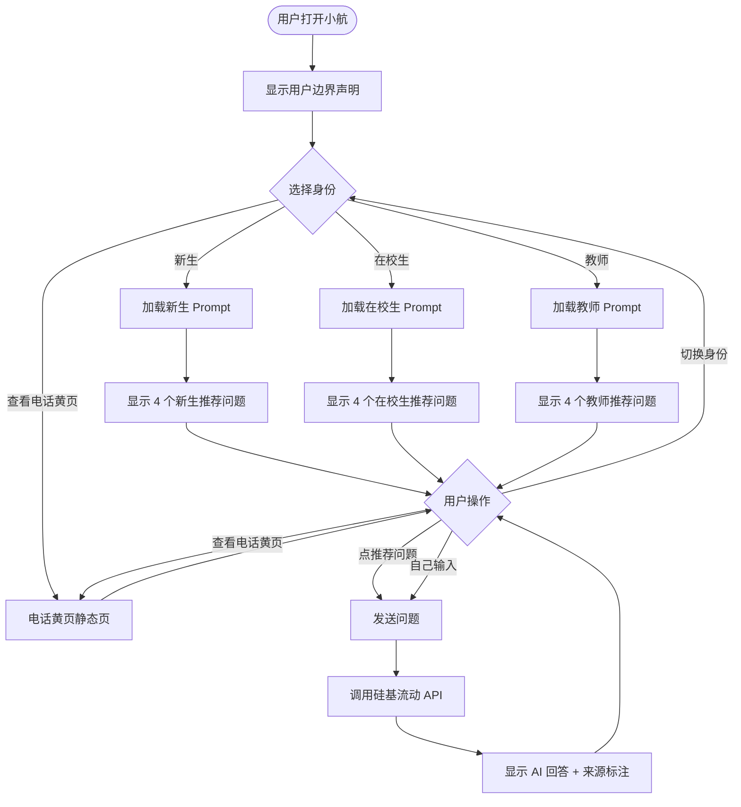

========================================
  【小航校园信息查询AI助手】 - 需求分析文档（初稿）
========================================

一、项目概述
  - 项目名称：小航 · 校园信息查询 AI 助手
  - 项目目标：为郑州航空工业管理学院师生提供智能化校园信息查询服务，支持新生报到、办事流程、电话黄页、应急防骗等场景的问答服务
  - 技术栈：Python + Streamlit + 硅基流动 API
  - 小组成员：人工智能专业大一学生

二、用户分析
  - 2.1 大一新生（优先级：高）
    - 特点：对校园完全不熟、信息焦虑、容易被骗、不会用官方系统
    - 高频需求：报到流程、宿舍情况、学费缴纳、军训安排、防骗知识
    - 高频问题示例：
      1. 报到那天先去哪?
      2. 学费什么时候交?
      3. 宿舍是 4 人间还是 6 人间?
      4. 有人冒充辅导员要钱怎么办?

  - 2.2 在校老生（优先级：中）
    - 特点：办事多、追求效率、不想听废话、已经熟悉校园
    - 高频需求：开在读证明、补校园卡、转专业、图书馆时间
    - 高频问题示例：
      1. 怎么开在读证明?
      2. 校园卡丢了怎么补?
      3. 转专业怎么转?
      4. 图书馆几点关?

  - 2.3 教师（优先级：中）
    - 特点：专业场景、需要政策依据、需要精确联系人
    - 高频需求：差旅报销、调课申请、设备报修、科研申报
    - 高频问题示例：
      1. 差旅怎么报销?
      2. 调课怎么申请?
      3. 教室设备坏了找谁?
      4. 科研项目去哪申报?

三、功能需求
  - 3.1 P0-1 校园问答（描述：用户输入问题，AI 基于学校资料回答，末尾标注来源 | 优先级：P0）
  - 3.2 P0-2 身份选择（描述：进入时选"新生/在校生/教师"，切换三套 Prompt | 优先级：P0）
  - 3.3 P0-3 推荐问题按钮（描述：12 个常见问题（每类 4 个），点一下直接发送 | 优先级：P0）
  - 3.4 P0-4 电话黄页静态页（描述：展示常用电话列表，不依赖 API，挂了也能用 | 优先级：P0）

四、应用流程
  - 4.1 主流程描述：用户打开小航 -> 显示用户边界声明 -> 选择身份（新生/在校生/教师）-> 加载对应身份的 Prompt -> 显示推荐问题 -> 用户操作（点推荐问题/自己输入/切换身份/查看电话黄页）-> 发送问题 -> 调用硅基流动 API -> 显示 AI 回答 + 来源标注 -> 返回用户操作

  - 4.2 流程图：

五、数据设计
  - 5.1 数据格式选型：Markdown（人写友好、AI 读得懂、可分级）
  - 5.2 数据文件清单：
    | 文件名 | 内容主题 | 主要服务对象 |
    |--------|---------|------------|
    | data/01_新生入学.md | 报到、宿舍、学费、军训 | 新生（优先） |
    | data/02_办事流程.md | 在校生办事 + 教师常用 | 在校生、教师 |
    | data/03_电话黄页.md | 全员电话（可独立展示） | 全员（兜底） |
    | data/04_应急防骗.md | 校园110、防骗、心理援助 | 全员（应急） |
    | data/05_交通出行.md | 校区交通、公交地铁 | 全员（扩展） |

  - 5.3 写作规范：
    1. 文件开头写维护信息（维护人、更新日期、数据来源）
    2. 用 ## 二级标题切分主题
    3. 涉及电话/金额/时间字段，行末加 ⚠ 以官方为准
    4. 未核验字段写 ✏️ 待核实
    5. 每个文件 1500~3000 字，合计约 1 万字

六、Prompt 设计
  - 6.1 身份分流策略：
    - 新生：你是小航，郑州航院校园助手。用户是大一新生，像热心学长一样详细解答，口语化，多鼓励。
    - 在校生：你是小航，郑州航院校园助手。用户是老生，简洁回答，重点：地点、电话、材料、时间。
    - 教师：你是小航，郑州航院校园助手。用户是教师，专业礼貌，重点：政策依据、办事窗口、联系人。

  - 6.2 别名词典：
    - "学校""航院""ZUA""郑航" = 郑州航空工业管理学院
    - "新校区""龙湖""新校" = 龙子湖校区
    - "卡""饭卡""校卡" = 校园一卡通
    - "保安""门卫""校警" = 保卫处
    - "迁户口""落户" = 户籍迁入/迁出
    - "调宿舍""换宿舍" = 宿舍调整申请
    - "证明""在读证明" = 在校学籍证明

  - 6.3 防幻觉硬规则：
    1. 只能根据【资料】回答，资料里没有的明说"这个我没收录，建议拨打 0371-61911000"
    2. 严禁编造电话号码、地址、办公时间、学费金额、人名
    3. 涉及金钱/转账，无条件提示"先联系辅导员核实，任何要求转账的都是诈骗"
    4. 涉及心理危机（自杀、不想活、活不下去等），立即给：12320-5 + 学校心理咨询中心 + 告诉辅导员
    5. 不接入学校系统（教务/一卡通/财务），被问"查我的成绩/课表/卡余额"礼貌拒绝
    6. 回答末尾标注 [来源:文件名]

七、用户边界声明
  - 能聊什么：新生报到、办事流程、电话黄页、应急防骗、交通出行
  - 不能聊什么：查个人成绩/课表/卡余额（不接入学校系统）
  - 数据更新日期：2026-07-16（如有出入，以官方为准）

八、不做的事
  - 不做向量库、RAG（大一阶段用不上，反而把概念搞乱）
  - 不做 LangChain（一个 requests 库就够，不引入框架）
  - 不做数据库（数据用 Markdown 文件，AI 直接读）
  - 不做用户登录（不存账号密码，不引入安全风险）
  - 不做部署上线（本地能跑、能演示就行）

========================================