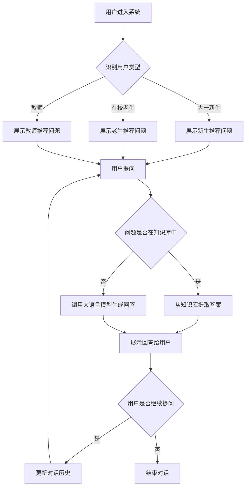

# 校园智能问答助手需求分析文档

---

## 一、项目概述

### 1.1 项目背景

随着高校信息化建设的深入，师生对校园服务信息的获取需求日益增长。然而，传统的信息查询方式（如官网浏览、电话咨询）存在效率低、信息分散等问题。本项目旨在开发一个**校园智能问答助手**，通过自然语言交互的方式，为不同类型用户提供精准、高效的校园服务信息查询。

### 1.2 项目目标

- 为大一新生提供入学适应相关的智能问答服务
- 为在校老生提供日常学业和生活服务的信息查询
- 为教师提供教学办公和行政事务的便捷咨询
- 实现多轮对话记忆，提升用户体验
- 构建结构化的校园知识库，确保信息准确可靠

### 1.3 技术方案

- **前端**：基于 Web 的对话界面
- **后端**：Python + FastAPI 提供 API 服务
- **AI 能力**：调用 DeepSeek 大语言模型实现自然语言理解和生成
- **知识库**：Markdown 格式的结构化文档存储

---

## 二、用户分析

### 2.1 大一新生

| 序号 | 高频问题 | 使用场景 | 优先级 |
|------|---------|---------|--------|
| 1 | 新生入学报到流程和需要准备的材料有哪些？ | 入学前准备阶段 | 高 |
| 2 | 宿舍入住规则、设施维修和熄灯时间是怎样的？ | 入住宿舍初期 | 高 |
| 3 | 校园卡充值、挂失和食堂/超市使用的相关问题？ | 日常消费场景 | 高 |
| 4 | 一年学费多少，餐厅在哪？ | 费用咨询和就餐需求 | 高 |

### 2.2 在校老生

| 序号 | 高频问题 | 使用场景 | 优先级 |
|------|---------|---------|--------|
| 1 | 课程退改选、成绩查询和绩点计算的相关规则？ | 选课季和成绩发布期 | 中 |
| 2 | 校园网连接、带宽升级和故障报修的方式？ | 日常网络使用 | 中 |
| 3 | 图书馆借阅、续借、馆藏查询和自习室预约？ | 学习场景 | 中 |
| 4 | 校园内各类证明（在读、成绩）的办理流程？ | 事务办理场景 | 中 |

### 2.3 教师

| 序号 | 高频问题 | 使用场景 | 优先级 |
|------|---------|---------|--------|
| 1 | 教室预约、多媒体设备使用和故障报修的流程？ | 教学准备阶段 | 中 |
| 2 | 学生成绩录入、教学任务安排和课表查询？ | 教学管理场景 | 中 |
| 3 | 校园办公系统登录、公文流转和行政事务办理？ | 日常办公场景 | 中 |
| 4 | 科研项目申报、经费报销和学术资源获取？ | 科研工作场景 | 中 |

---

## 三、功能需求

### 3.1 P0 功能清单

#### 功能一：校园问答

| 项目 | 内容 |
|------|------|
| **功能描述** | 用户通过自然语言提问，系统自动匹配知识库内容进行回答 |
| **设计理由** | 核心功能，满足用户最基本的信息查询需求 |
| **使用场景** | 用户询问校园服务相关问题时 |
| **技术实现** | 基于大语言模型的语义匹配和知识检索 |

#### 功能二：推荐问题

| 项目 | 内容 |
|------|------|
| **功能描述** | 根据用户类型（新生/老生/教师）展示高频推荐问题 |
| **设计理由** | 降低用户提问门槛，引导用户快速获取所需信息 |
| **使用场景** | 用户首次进入对话界面或不知道如何提问时 |
| **技术实现** | 根据用户角色展示预设的推荐问题列表 |

#### 功能三：电话黄页

| 项目 | 内容 |
|------|------|
| **功能描述** | 提供校园各部门联系电话的查询服务 |
| **设计理由** | 部分问题需要人工解答，提供联系方式便于用户进一步咨询 |
| **使用场景** | 用户需要联系校园部门时 |
| **技术实现** | 结构化存储部门名称、电话、办公地点等信息 |

#### 功能四：多轮对话记忆

| 项目 | 内容 |
|------|------|
| **功能描述** | 系统能够记住当前对话中的上下文信息 |
| **设计理由** | 提升对话连贯性和用户体验，支持上下文相关的追问 |
| **使用场景** | 用户进行连续提问或追问时 |
| **技术实现** | 通过 `messages` 列表存储对话历史，每次请求携带完整历史 |

### 3.2 P1 功能（预留）

- 语音交互：支持语音输入和语音播报
- 图文消息：支持图片、表格等富媒体展示
- 消息推送：重要通知的主动推送
- 多语言支持：支持中英文切换

---

## 四、应用流程

### 4.1 用户对话流程图



### 4.2 核心流程说明

1. **用户识别**：系统根据用户登录信息或首次交互识别用户类型
2. **推荐展示**：根据用户类型展示对应的高频问题推荐
3. **问题处理**：
   - 优先匹配知识库，确保信息准确性
   - 知识库未覆盖的问题，调用大语言模型生成回答
4. **上下文维护**：通过 `messages` 列表维护对话历史，支持多轮对话
5. **对话结束**：用户主动退出或超时自动结束

---

## 五、数据设计

### 5.1 知识库文件清单

#### 1. `入学指南.md`

```markdown
# 入学指南

## 1. 报到流程
### 1.1 线上注册
### 1.2 资格审核
### 1.3 领取物资

## 2. 准备材料
### 2.1 必备证件
### 2.2 生活用品
### 2.3 学习用品

## 3. 校园地图
### 3.1 教学楼分布
### 3.2 宿舍区分布
### 3.3 食堂位置
```

#### 2. `生活服务.md`

```markdown
# 生活服务

## 1. 宿舍管理
### 1.1 入住规则
### 1.2 设施维修
### 1.3 熄灯时间

## 2. 校园卡服务
### 2.1 充值方式
### 2.2 挂失流程
### 2.3 使用范围

## 3. 餐饮服务
### 3.1 食堂分布
### 3.2 就餐时间
### 3.3 特色窗口
```

#### 3. `学业事务.md`

```markdown
# 学业事务

## 1. 课程管理
### 1.1 选课流程
### 1.2 退改选规则
### 1.3 课表查询

## 2. 成绩管理
### 2.1 查询方式
### 2.2 绩点计算
### 2.3 成绩申诉

## 3. 图书馆服务
### 3.1 借阅规则
### 3.2 续借流程
### 3.3 自习室预约
```

#### 4. `行政办公.md`

```markdown
# 行政办公

## 1. 教学管理
### 1.1 教室预约
### 1.2 设备报修
### 1.3 成绩录入

## 2. 办公系统
### 2.1 登录方式
### 2.2 公文流转
### 2.3 事务办理

## 3. 科研服务
### 3.1 项目申报
### 3.2 经费报销
### 3.3 学术资源
```

### 5.2 写作规范

| 序号 | 规范要求 | 说明 |
|------|---------|------|
| 1 | 使用 Markdown 格式 | 便于结构化存储和阅读 |
| 2 | 层级清晰 | 使用 `#`、`##`、`###` 建立目录结构 |
| 3 | 关键词明确 | 在标题和段落中包含高频查询关键词 |
| 4 | 信息准确 | 确保所有信息与官方渠道一致 |
| 5 | 更新及时 | 定期检查并更新过期信息 |

---

## 六、Prompt 设计

### 6.1 身份分流系统

#### 身份一：新生助手

```
你是一名热情友好的高校新生辅导员，专门帮助大一新生适应大学生活。
你的语气亲切温暖，使用表情符号增加亲和力。
回答要简洁明了，避免使用专业术语。
```

#### 身份二：老生助手

```
你是一名资深的在校学生，熟悉校园各项事务和规章制度。
你的语气沉稳专业，提供的信息准确可靠。
回答要详细全面，包含具体的操作步骤。
```

#### 身份三：教师助手

```
你是一名高校行政助理，熟悉教学管理和行政办公流程。
你的语气正式严谨，提供的信息规范权威。
回答要条理清晰，符合学校官方表述。
```

### 6.2 组别名词典

| 组别 | 别名 | 说明 |
|------|------|------|
| 校园卡 | 饭卡、一卡通、学生卡 | 指代校园消费和身份认证卡片 |
| 教学楼 | 教学区、教室、上课地点 | 指代学生上课的场所 |
| 图书馆 | 自习室、借阅室、书库 | 指代学校图书借阅和学习场所 |
| 教务处 | 教务系统、选课系统、成绩系统 | 指代负责课程管理的部门 |
| 后勤处 | 后勤、维修、物业 | 指代负责校园设施维护的部门 |
| 财务处 | 收费处、结算中心 | 指代负责费用收取和报销的部门 |
| 研究生院 | 研招办、研究生部 | 指代负责研究生管理的部门 |

### 6.3 防幻觉硬规则

| 序号 | 规则内容 | 执行方式 |
|------|---------|---------|
| 1 | 对于不确定的信息，明确告知用户 | 在回答中加入"不确定"、"建议咨询"等表述 |
| 2 | 不编造不存在的信息 | 只基于知识库内容回答，超出范围时说明 |
| 3 | 涉及费用的信息必须准确 | 引用官方公布的标准，不估算 |
| 4 | 联系方式必须核实 | 只提供确认过的电话和地址 |
| 5 | 时间信息必须精确 | 明确说明日期、时间段，不模糊表述 |
| 6 | 引导用户查阅官方渠道 | 对于重要事务，建议用户通过官方渠道确认 |

---

## 七、用户边界声明

### 7.1 能聊什么

- ✅ 校园服务信息查询（报到流程、宿舍规则、校园卡使用等）
- ✅ 学业事务咨询（选课规则、成绩查询、图书馆使用等）
- ✅ 行政办公流程（证明办理、教室预约、系统登录等）
- ✅ 校园生活指南（食堂位置、交通路线、活动信息等）

### 7.2 不能聊什么

- ❌ 个人隐私信息（学生个人成绩、教职工私人信息等）
- ❌ 敏感话题（政治、宗教、违法信息等）
- ❌ 学术作弊（代写作业、考试答案等）
- ❌ 商业广告（推销产品、引导消费等）
- ❌ 非校园相关话题（娱乐八卦、时事新闻等）

### 7.3 数据更新日期

- **最后更新日期**：2026年7月14日
- **更新频率**：每月更新一次
- **重要提示**：系统提供的信息仅供参考，具体以学校官方通知为准

---

## 八、不做的事

| 序号 | 不做的事 | 理由 |
|------|---------|------|
| 1 | 不处理紧急事务 | 紧急情况应通过电话直接联系相关部门 |
| 2 | 不提供医疗建议 | 健康问题应咨询校医院或专业医疗机构 |
| 3 | 不代替用户办理事务 | 重要手续需要用户本人到场办理 |
| 4 | 不存储用户隐私数据 | 保护用户隐私，不收集敏感信息 |
| 5 | 不参与商业活动 | 保持服务的公益性和客观性 |

---

**文档版本**：v1.0  
**创建日期**：2026年7月14日  
**小组编号**：第X组